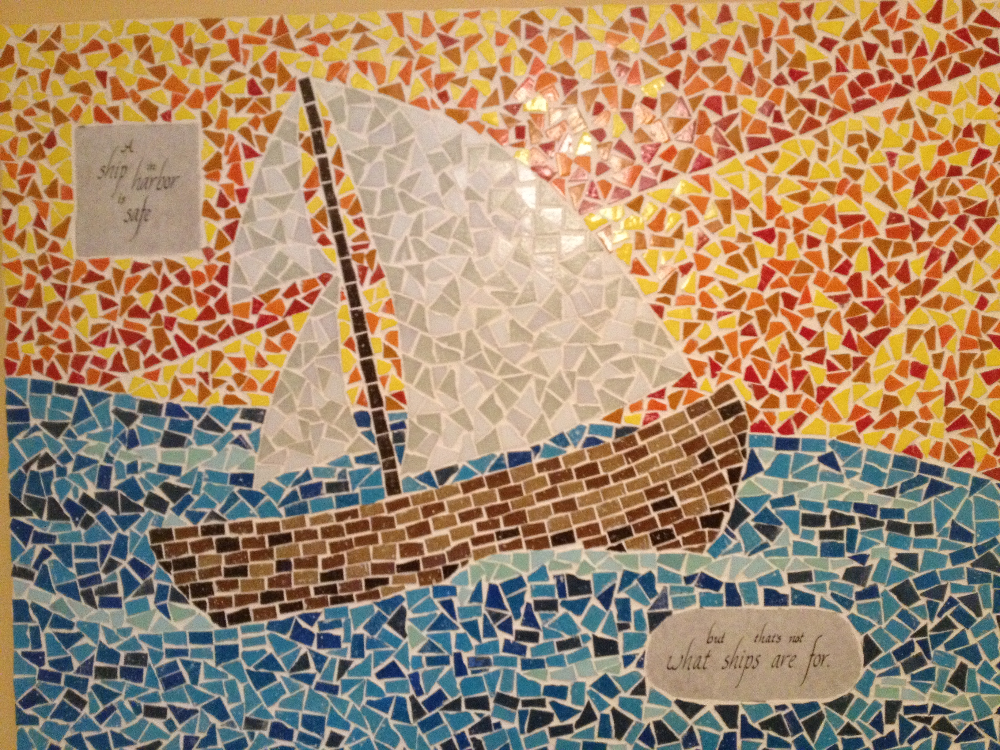
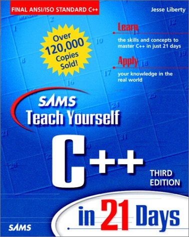
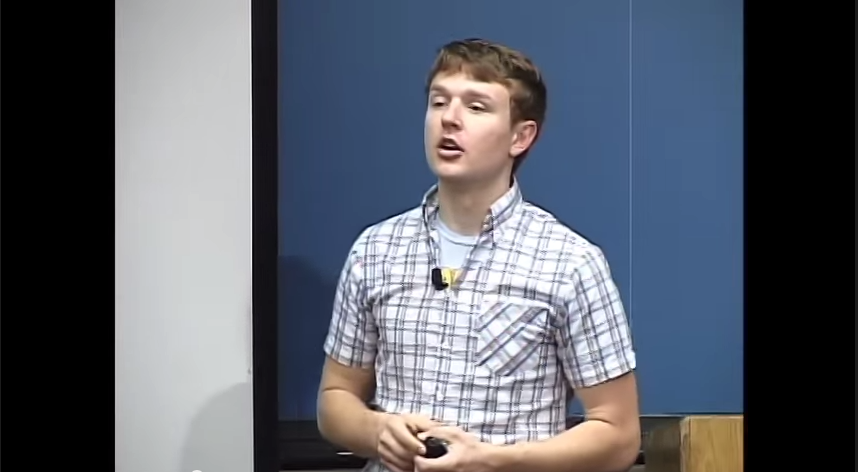
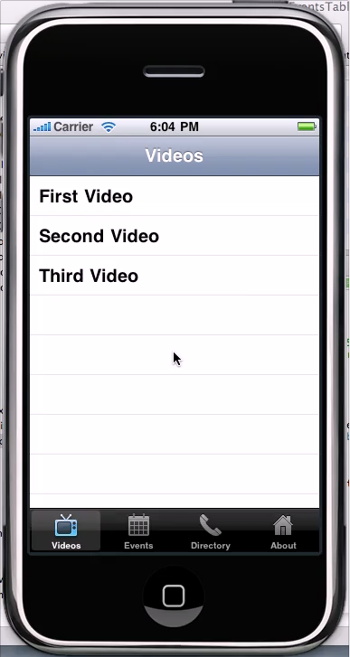
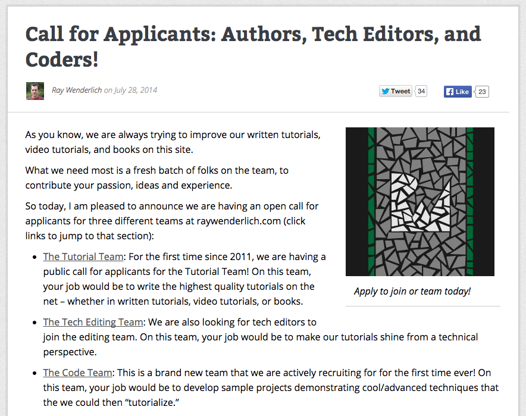
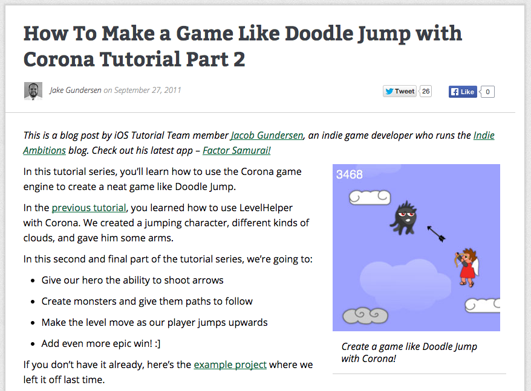
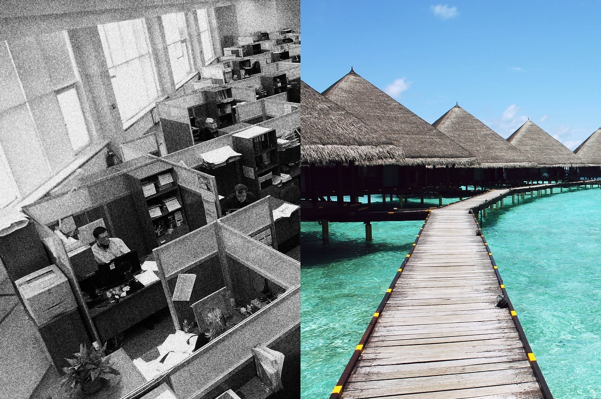

# [Fit] Opportunity

---

^ I’d like to ask all of you to consider the last 3 months or so, in terms of what you’ve been doing as a profressional. During this time, have you ever felt like this guy, like you have no idea what you’re doing?

---

^ Have you ever felt like this guy , like you’re struggling or even failing? 

---

^ Have you ever felt like this guy , where you felt envious of someone else’s skills or success and wished you could be at that level?

---

^ I’d wager that most of us have our eye on some achievement, some project, some app idea, or some job that we’d love to be doing. 

^ Some of you have answered a strong yes to some of these questions, that's pretty normal. But I’m willing to bet that some of you out there have said, “No, you know I’m feeling pretty good right now, my career’s going well, I kinda know what I’m doing, life’s all good.” And I think everybody has felt that way, too.

---

# [fit] All Good = Too Safe

^ The thing is, if you’re feling pretty good, if you’re feeling like things are going smooth, I’d argue that this is the sign that you are playing it too safe. You aren’t taking enough risks. You’re missing out on opportunities that you could use to stretch yourself.

---

>
> #A ship in the harbor is safe; 
> #but that’s not what ships are for
>
### - John A. Shedd

^ There’s this quote I love by John A. Shedd that says the following:

^ It’s really tempting to want to sometimes play it safe in life, especially when things are going well. We get comfortable with our current careers, skillsets, or ways of doing things, and don’t really want to set sail for exotic lands. 

---

^After all, there are tons of risks in any journey – our ship could sink, we might not know the first thing about sailing, or we could come across some unfriendly natives. 

^ But, the trickiest part of life is that we don’t know what we don’t know. We can’t measure the value of the experiences we haven’t had yet.

---

^ But I believe that there are opportunities waiting for us. We'll have the chance to surpise and amaze ourselves. But, the only way to enjoy some achievements is to put yourself into those scary situations where you feel like you don’t what you’re doing, where you’re struggling, where you’re aspiring toward a higher level. That’s how we stretch ourselves, develop new skills, and encounter lands. 

^ I’m finding that some of my best experiences are things I didn’t know I wanted, and only came through pushing myself into my discomfort zone.
 

---

###[FIT]OPPORTUNITY

^ But if we’re in this safe situation where things are going great, how can we push ourselves to take this journey? That’s exactly what I would like to talk to you today. 

---

## [fit] Opportunity
## [fit] that seeks you out

^ I’ll share with you my story – how I started in a nice, secure job, that had nothing to do with programming – and took advantage of a sequence of opportunities that transformed me into a successful iOS developer, author, and contractor. I’ll share with my perspective on how you can identify and take advantage of opportunities that come across your life – especially those scary ones that we might think are above our league.

^ I’ll begin with my story, which I’d like to tell in terms of three opportunities that I took that made a huge difference in my life.

---

^ The first opportunity I’d like to highlight is the opportunity I had to write my first real, paid, app. 

^ This was several years ago – a buddy of mine asked me to write his brother in law an app. I had actually just graduated from business school, and although I had interest in programming and dipped my toe in more than once, I'd never finished a project. 

^ I had wanted to, and tried to learn to program through most of my teenage years and early 20s. I’d pick up a book on C++ and dive in, but inevitably the learning curve was too steep and I’d eventually get frustrated and distracted and move on to other pursuits. I never got to the point where I felt like I was able to come up with and idea, and see that idea through to completion. Until I made my first $3,000 writing an app for my buddy.

---

^ I was interested in learning how to program for the iPhone and I’d watched some of the iTunes U videos.  But, there was so much I didn’t know. For example, I didn’t know how to make interface builder work, what a delegate was, and I didn’t understand the navigation stack.

^ I’ll be honest, I almost said no. I really wasn’t sure if I could do it, and didn’t want to let my friend down. But luckily he said “Jake, just give it a shot – if it doesn’t work out, I can always hire someone else.” So I took him up on it, started going through some books and tutorials, and started making the app. It was hard, but I got through it, and I was paid to write a program for the first time in my life.

---

^ This small success had an effect on my psyche, after this happened, I felt that the things I always wanted to do, that seemed to hard, out of reach, were now possible
I was able to take that success and continue making apps – both with my buddy, and later with other clients too, and was able to quit my job and become a full time iOS contractor. Taking this opportunity literally changed my life, and I still shudder to think how close I was to saying no.

---

### [fit] Opportunity 
### [fit] that you seek out

^ The second opportunity I’d like to highlight is the opportunity I had to become a part of raywenderlich.com.

---

^ I had become a fan of the site after I got into game development, and learned a lot about Cocos2D on the site.  One day I saw a post on the site calling for tutorial writers, and I was really tempted to join in because I liked the site so much and wanted to help out.

---

^ But again – I came really close to not applying at all. First, I felt like I was like 
I was still pretty green, and probably wasn’t as knowledgeable as the other applicants. Second, I’ve never considered myself a good writer. 

^ The flip side of the coin, however, was that it was something that I respected and admired. It was the kind of thing that I wanted to be able to do, and I knew if I could pull it off I’d feel really good about myself. I’d feel like I was awesome. 

---

^ So, in spite of my fear, I decided to give the opportunity a shot anyway and emailed Ray. It turned out Ray was looking for a tutorial on game programming with Corona and I had some experience with that, so I wrote a tutorial on that and Ray published it on the site.  

---

^ This first tutorial was a big accomplishment in my life. Having something I'd written in a place where there was real traffic was pretty cool. I felt proud of myself. But even better, this one small opportunity snowballed to other opportunities. I later contributed to every book in the iOS by Tutorials series, wrote my own Platformer Game Starter Kit, run the raywenderlich.com podcast with Mic, and am here today with you at this conference. It all stemmed from another opportunity that I almost didn’t take up.

---

### [fit] Opportunity  
### [fit] that you make

^ Along came image prcessing

^ The third and final opportunity I’d like to highlight today is my involvement with the GPUImage open source project.

---

^ I had written a few chapters about Core Image in the iOS by Tutorials series which got me really interested in learning how to write shaders on the GPU. A new video/photo processing framework called GPUImage was created about that time. I was so excited because I wanted more customization in Core Image and I wasn't going to get it from Apple (we just barely got custom kernels in iOS 8).

---

^ This is an example of an opportunity that I made for myself. I could have just played around with learning how to make shaders and work with GPUImage all on my own. But I decided instead to get involved with the community. I started submitting filters and for a while I was one of the top contributors (it was nothing compared to the author, but I was in the top 3 or 4 for a while).

^ Contributing to GPUImage has turned out great for me. These days more than half the work I do is for clients that need help with this framework. Because not that many iOS developers know OpenGL, it's a nice differenciator. I can get a premium rate when I do this kind of work, and my clients are often other programmers who don't have the desire to learn it themselves. 

^ I even got a call from Apple looking to recruit me for their Core Image team, based on the work I had done on GPUImage – I didn’t end up getting the job, but I would have never even applied to a job at Apple, I wouldn't dare believe that I was in that league (especially because I have no formal engineering education and only a few years experience at that point), but because I made my own opportunity to to write some GLSL for an open source project, Apple came to me.  

---

^ A few months ago, I was able to talk to Brad Larson, author of the framework on the podcast. This was a highlight of the year.

---

### [fit] One thing in common

^ But there was one common thing across all of these opportunities – every single time, I didn’t feeel qualified, I felt like I didn’t know what I was doing, 

---

^ and I felt like I was out of my comfort zone. But I was able to pull through – and my point is that you can do the same, and that is exactly how you grow.

---

^ My stories just examples. In your life, you will come across countless opportunies just like this – it’s your job to reach out and grab them.

^ But how can you make sure you actually take the opportunities you come across, even when they feel a bit uncomfortable, rather than keeping your ship safe in its port?

---

^ For that there’s a rule I live by – a secret to taking advantage of the opportunities you come across in life. I learned this secret from a book, Tina Fey’s book, “Bossy Pants.” There’s a passage in the book that explains this secret – let me paraphrase the passage for you here.

---

^ The book is talking about improvization – some of you may be famliliar with improvization from TV shows like “Who’s Line Is It, Anyway?” In improvization, actors make up a story – on the fly – without any preparation. It’s pretty cool and funny to watch.

---

###[FIT]YES

^ In the book, Tina explains that the first rule of improvization is to agree. Always agree, and say yes. 

---

##[FIT]“Freeze! I have a gun”

^ For example, if I was improvizing with you and I held up my hand like this and said “Freeze! I have a gun”, and you say “Aww, that’s not a gun, you’re just pointing your finger”, well I won’t know what to say next our scene has just ground to a halt. But if I say “Freeze! I have a gun”, and you say “The gun I gave you for Christmas?! You bastard!” then we’ve started a great scene – because we’ve agreed my finger is in fact a gun.

---

### [FIT] Always Say YES

^ The book goes on to explain that we can extend this rule to real life – rather than having a knee-jerk reaction of NO to opportunities that come across us, always say YES and see where that takes you.

---

### [FIT] "I can't do this"
### [FIT] "I'm not qualified"
### [FIT] "It's too much work"

^ In my life, whenever I felt myself seizing up and saying “I can’t do this”, or “I’m not qualified”, or “It’s too much work”, I’d think back to Tina Fey’s book. 

---

### [fit]INTIMIDATION = YOU WANT IT 
### [fit]Pursue the thing that most impresses you

^ I realized I should try and do things, even if they were hard or if I found them intimidating – especially those things that intimidated me in fact.

---

#[fit]Always Say YES

^ Imagine what your life could be if you started with always said YES. What sort of crazy adventures could you get into? What sort of new projects might you try that you wouldn’t have otherwise? What could you learn, and and how could you grow?

---

^ It’s definitely made a huge difference in my life. Small opportunities grow into larger ones. I used to work in a cubicle doing work that I found boring. Now I work on interesting projects and I can set my own hours.

---

^ small opportunities grow into larger ones

!(all opportunities.jpg)

---

^ So remember, if you start to feel too comfortable, that feels great, but it’s a trap. 
^ It’s a sign that you’re not stretching yourself enough, and you’re not taking advantage of the many opportunities before you.

---

^  I challenge you all to get out of your comfort zone

---

# [fit] Always Say YES

^ always say YES

---

^ and sail your ship to new and exotic lands. 

